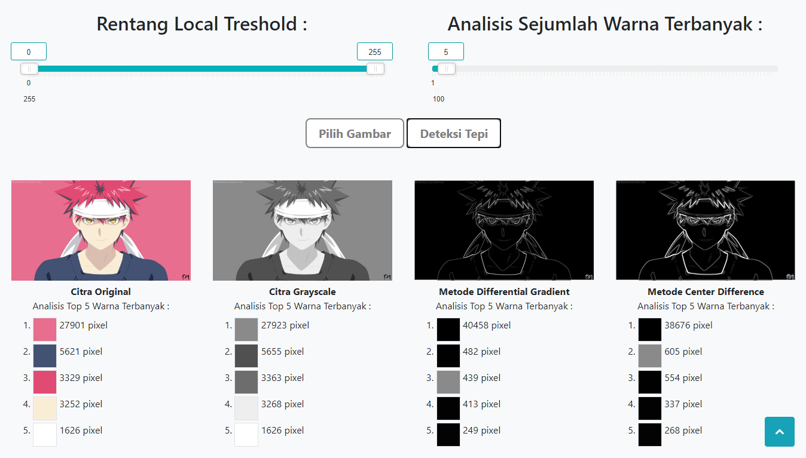
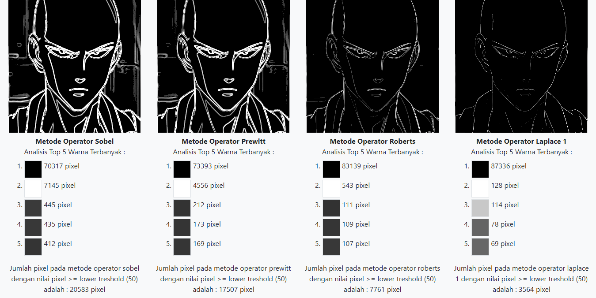
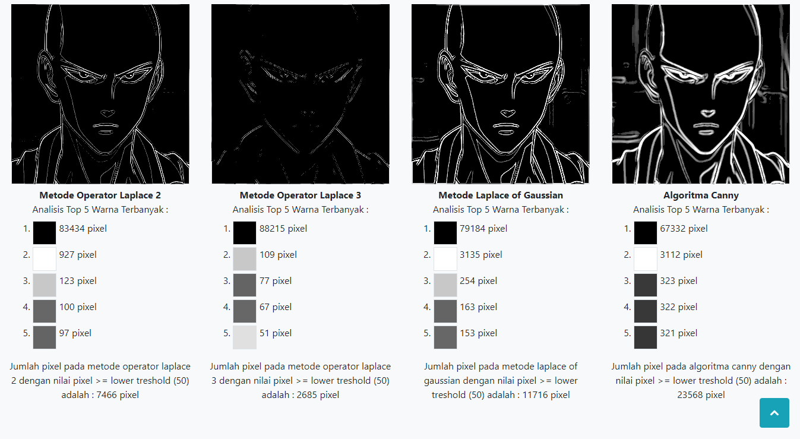
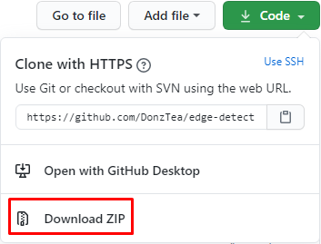
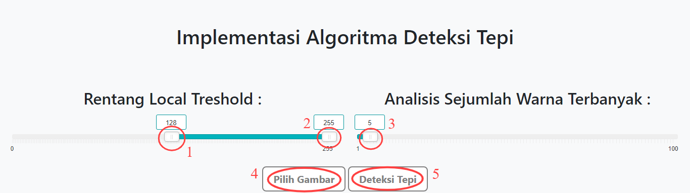

# Penerapan Algoritma Deteksi Tepi

Aplikasi ini merupakan penerapan dari beberapa metode deteksi tepi seperti differential gradient, center difference, sobel, prewitt, roberts, laplace, laplace of gaussian, dan algoritma canny. Aplikasi ini dibuat menggunakan bahasa JavaScript dengan sintaks ES6.

## Antarmuka aplikasi





## Disclaimer

Aplikasi ini hanya sebatas tugas kuliah saya.

## Requirement

> npm v6.14.6

## Prerequisite

> Mengerti cara melakukan clone project / download zip source code dari Github.

## Instalasi

Ada dua cara instalasi yang saya uraikan, silakan gunakan cara yang dirasa nyaman dan familiar. Bagi yang terbiasa dengan perintah git, silakan gunakan [cara pertama](#instalasi-dengan-cara-clone-git-repository). Jika tidak familiar dengan git, bisa gunakan [cara kedua](#instalasi-dengan-cara-download-zip).

### Instalasi dengan cara clone git repository

1. Pada command prompt / terminal, eksekusi perintah berikut ini :

```
git clone git@github.com:DonzTea/edge-detection-algorithms.git
```

2.  Masuk ke folder yang telah di-clone tersebut dengan perintah :

```
cd edge-detection-algorithms
```

3.  Install library yang diperlukan beserta dependency-nya dengan perintah:

```
npm install
```

### Instalasi dengan cara download zip

1. Download source code dalam bentuk zip dengan cara klik tombol code, kemudian klik download zip seperti gambar di bawah ini.

<p align="center">
  
</p>

2. Extract file zip yang telah didownload.
3. Buka command prompt / terminal, masuk ke direktori dimana folder yang telah diextract tadi berada.
4. Install library yang diperlukan beserta dependency-nya dengan perintah:

```
npm install
```

## Menjalankan aplikasi

1.  Start local server menggunakan command `npm run start`.
2.  Buka browser, kemudian akses `http://localhost:8080`.

## Tutorial penggunaan aplikasi



1. Atur besaran lower treshold dengan cara menggeser slider.
2. Atur besaran upper treshold dengan cara menggeser slider.
3. Atur jumlah warna paling dominan yang akan ditampilkan dengan cara menggeser slider.
4. Pilih gambar yang ingin diproses.
5. Klik tombol deteksi tepi untuk melakukan proses deteksi tepi.
